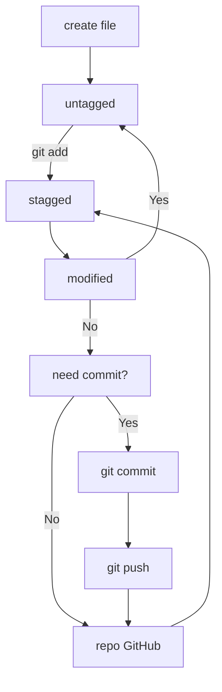

# Hello
## Hello
### Hello
#### Hello
##### Hello
###### Hello

Text 

---

Text under line

Text before breake..
Text after breake <br>
Text after second breake

line1
another line

line2

another line

*Text* or _test_

**text** or __test__

~~text~~

* first point of list;

* second point of list.

- first;

- second.

[Yandex](http://www.ya.ru "Ya am Yandex!")

```bash
ls -la
```
```html
<h1> It's a simple text</h1>
```
# Git shpargalka

## Practic work 1
```Bash

1. cd ~ $$ mkdir new-project $$ cd`~/new-project
2. ls -a
3. git config --global user.name "firstname lastname user" $$ git  config --global user.email "email" $$ cat ~/.gitconfig
4. git init
5. touch readme.md $$ notepad readme.md
6. git add ~/new-project/.
7. git commit -m "my first project"
8. ls -la .ssh
# if not keys to do,else not create ssh keys
9. ssh-keygen -t ed25519 -C "emal user"
# copy copy in memnory PC
10. clip < ~/.ssh/id_25519.pub
11. Account github -> new ssh key-> in field key-past copy key
12. ssh -T git@github.com
13. git remote add origin git@github.com:%account name%/new-project.git
14. git remote -v
15. git push -u origin master

```
## Practic work 2 
1. Hash commit is a otpechatok file with sha-1 
2. command git log -predstavlenie all commits
3. command git log --oneline  predstavlenie all commits in small version
4. HEAD - ykazatel na posledniy commit i mojno na pryamyju obrshatsya k nemy
Lejit v papke .git i ssylaetsya na dir refs(vnytri nee ssylka refs/heads/master v kotoryju zapis hash poslednego commit)

### Diagram Lifecircle  files commits


